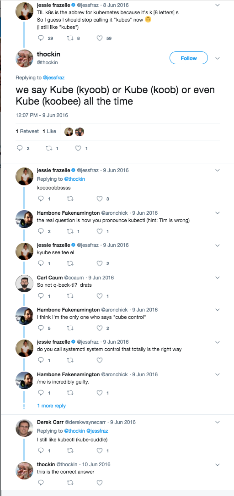

# KubeCon + CloudNativeCon 2017
---
# Major Themes
* Service Meshes
* Building Paved Roads
* War Stories
* Extensibility
---
# Anouncements
---
## K8S 1.9
* DaemonSets, Deployments, ReplicaSets, and StatefulSets all promoted to Beta
* CoreDNS replacing kube-dns
---
## Releases
* CoreDNS 1.0
* Containerd 1.0
* Fluentd 1.0
* Prometheus 2.0
* Envoy 1.5.0
---
## Conduit
* Lighter footprint than linkerd
* Designed for K8s as a sidecar
* 1MB memory foorprint in their demo
* CLI for live mesh stats
---
## New fluentbit daemon coming
* Smaller footprint
* Written in C
* Supports plugins in golang
---
## Kata Containers
* Bridging VMs and containers
* Hardware acceleration for containers
* No public code yet
---
## AWS
* NLB support in Alpha
* C5/M5 support in K8s 1.9
---
## EKS
* IAM auth
* Kube2IAM
* Vault/SPFEE integrations
* Committing to the OpenSource experience
* Pushing back to upstream
---
# Take Aways
---
## Calico is what a lot of people are gravitating towards
We should migrate now before our usage ramps up
---
## We're going down the right path!

Curated Helm charts with a Values file as the deployment contract is a common pattern

Netflix had a shift from "Let me control every knob" to "Give me sane defaults"
---
## We're going down the right path!
`kubectl` is the new `ssh` If you're deploying to production with `kubectl` you are missing steps
Doing it right means that kubernetes is hidden to the developers
-Kelsey Hightower
---
## We're going down the right path!
* CodeKarma's Monolith -> Microservices
* 7 year old php monolith
* Started with small services outside the critical path
* Used linkerd to bridge the monolith and microservices
* [Slides](https://schd.ws/hosted_files/kccncna17/39/Monolith%20to%20Microservices%20-%20Kubecon%202017.pdf)
---
## We should be use OpenTracing
Its the Peanut Butter to the Service Mesh's Chocolate
---
## Documentation pipelining
* Intent is to have development groups take ownership of services as 3rd party APIs
* need a central hub for cross dissemination of contracts across teams
  * Swagger is a good reference documentation for many developers.
  * not all questions can be answered by swagger
    * long form documentation and api reference being in the same repo as the code pushes documentation best practices.
  * add documentation deploy as bundled part of service deploy
    * versioned to deployed service
---
## Helm CICD
* They use Gitlab ci-runners.
* A lot of caveats on how they use helm charts
  * for development:
    * Set max unavailable to 0 on 1 replicacount value
      * if someone wants to deploy with a replica count of 1
    * in regard to sane defaults
      * Flag for clients/splunk/DD logging sidecar.
        * Have option for custom sidecar
        * major amounts of code login in templates in helm charts
      * sane defaults if not flagged, if flag is set in values, then allow for modification.
---
# Tools
---
[Open Policy Agent](https://github.com/open-policy-agent/opa)
* Netflix tool for authorization
* Solves Policy for any (I)dentity performing (O)peration on (R)esource
* Pluggable for I,O,R
* SLO of <1ms per evaluation
* 20us benchmarked using 2000 roles in 2000 bindings on a single i7 core
* Allows for terraform testing
---
[kube-metacontroler](https://github.com/GoogleCloudPlatform/kube-metacontroller)
* Prototype tool for implementing custom controlers
* Deployed a new Implementation of StatefulSets using 100 lines of js
* no Imports/Dependencies
---
[fission.io](http://fission.io/)
* Framework for running serverless functions on K8s
---
[Kubespawn](https://github.com/kinvolk/kube-spawn)
* Run local multi-node k8s clusters
* Used by K8S devs for development
---
[Squash](https://www.solo.io/single-post/2017/08/22/Technical-introduction-to-Squash)
* Connect a debugger to a live pod via VSCode
---
[kubetest]()
* Unit-Testing/Linter for K8s objects
---
[Kubernetes Code Generators](https://github.com/kubernetes/code-generator)
[Operator-Kit](https://github.com/rook/operator-kit)
* For Implementing K8s API types
* Use CRDs in code
* Operator Kit is a lib for working with CRDs with sample code
---
[telepresence.io](www.telepresence.io)
* Proxy for bridging a dev machine into a K8s cluster
---
[Calico App Policy](http://github.com/projectcalico/app-policy)
* Can Scope Policy by App Selectors
* Demoed protection with both a leaked mTLS key and compromised pod
---
[CoreOS Clair](https://github.com/coreos/clair)
* Image static analysis and vulnerability scanner
---
[Grafeas](https://github.com/Grafeas/Grafeas)
* Metadata for K8s components API
---
[Manifesto](https://github.com/aquasecurity/manifesto)
* Container image metadata storage and management interface.
---
[istio-vet](https://github.com/aspenmesh/istio-vet)
* Istio and user application validation.
---
[Metaparticle](https://github.com/metaparticle-io)
* Cloud native standard library for Containers and Kubernetes
* Keynote will be up: [detail](https://kccncna17.sched.com/event/CUCZ/keynote-kubernetes-this-job-is-too-hard-building-new-tools-patterns-and-paradigms-to-democratize-distributed-system-development-brendan-burns-distinguished-engineer-microsoft)
---
# Good Links and Presentations
---
## All Presentations
[Schedule](https://kccncna17.sched.com/?mobileoff=Y)
---
## Hacking Kubernetes
A pentester demonstrates how many default settings lead to RCE, Leaked Source Code, and compromised AWS accounts
[Slides](goo.gl/TNRxtd)
[Demo](goo.gl/fwwbgB)
* [sonobuoy plugin benchmark](https://github.com/bgeesaman/sonobuoy-plugin-bulkhead)
* [kube-benchmark](https://github.com/aquasecurity/kube-bench)
---
## Istio Workshop
Hello World type setup on kubernetes using Routing Policies and more
[Workshop](https://github.com/retroryan/istio-workshop)
---
## Stupid kubectl tricks
Collection of useful but not well documented commands
[Tricks](http://bit.ly/stupid-kubectl-tricks)
---
## 101 Ways to Crash a Cluster
[Slides](https://schd.ws/hosted_files/kccncna17/20/KubeCon%20NA%202017-101%20Ways%20to%20Crash%20Your%20Cluster.pdf)
Production lessons from Nordstrom running K8s
---
## HBO - Pushing the limits with Game of Thrones
[HBO Keynote](https://schd.ws/hosted_files/kccncna17/d6/KubeCon_Keynote_HBO.pdf)
---
## Minikube Developer Workflow and Advanced Tips
[Slides](https://schd.ws/hosted_files/kccncna17/2b/Minikube%20Developer%20Workflow%20and%20Advanced%20Tips%20-%20Final.pdf)
---
## Netflix overview of OAP
[How Netflix is Solving Authorization Across Their Cloud](https://schd.ws/hosted_files/kccncna17/cb/Manish%20Mehta%20Netflix%20AuthZ%20V4.pdf)
---
# Fun Stuff
---
### From the mouth of the creator
kubectl is pronounced Cube Control!
Errata: https://twitter.com/thockin/status/740983765787238400

---
### An engineer had a k8s cluster running on ARM SmartWatches
* Had custom built docker and kubelet on Astroid OS
* Ran a service to turn the screens from Red to Blue
---
## Cluster management API
* Builders of Kubicorn
* Aggregated API server
  * API server is becoming a standard for adding api functionality
* API integration to kops, kubicorn, and a couple other tools to wrap functionality into single interface.
---
`kubectl apply -f <url>` is the new `sudo curl <url> |bash`
---
Kelsey Hightower created an 8 node k8s cluster, deployed an app, and scaled it to 10 pods with Google Voice commands
